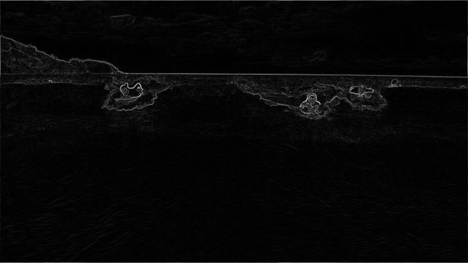
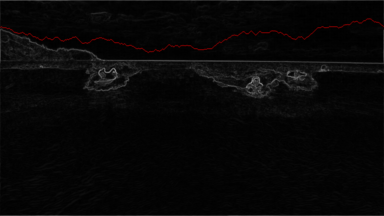
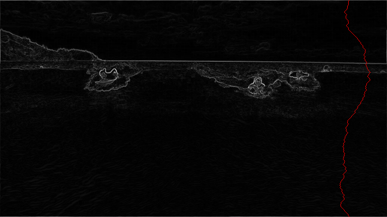
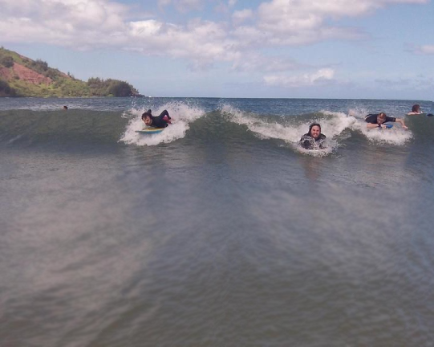

# seam-carving
An algorithm for content-aware image resizing.

### How to Use
1. Clone this repository
2. Upload your image to the root directory
3. Run `java -classpath :.lift/algs4.jar ResizeDemo [image filename] [num cols to remove] [num rows to remove]`

### How it Works

An image is provided. 

An energy value for each pixel is calculated. This approximates how much the RGB values of a pixel contrast with those of its neighbouring pixels.

A dynamic programming algorithm is used to find horizontal and vertical seams of minimum energy.

The minimum energy seams are sequentially removed to shrink the image and preserve its main features without distortion or cropping.

